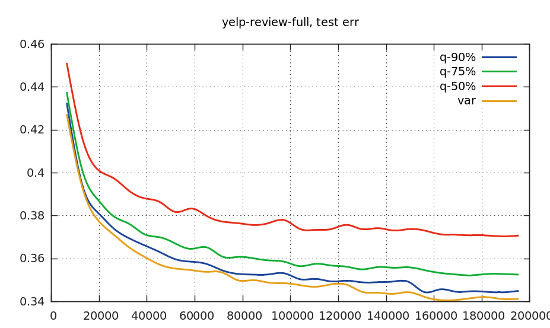

# Variable-Length vs Fix-Length
When feeding a document to the convnet during training or evaluating, there are two choices:

* Fix-Length. The document is truncated (by ignoring longer texts) or elongated (by filling zero word vector) to be a fix length.
* Variable-Length. Every word in document is always included.

We find that adapting to variable-length seems better than enforcing the fix-length on certain dataset. 
We demonstrate this by experiments on the dataset "yelp-review-full",
where the document length (#words) of the training set is summarized below:
```
min len = 5
max len = 1191
mean len = 159

90%-quantile len = 329
75%-quantile len = 206
50%-quantile (median) len = 118
```

We compare the error rates for variable-length and fix-length (90%-, 75%- and 50%- quantile, respectively).
It is evident from the below figure that the error rate of variable length decreases faster than the others.
 



## Run the Script
To run training/evaluating for the three fix-length configs:
```lua
th scripts/fixtail-word-seqconv/tr_yelprevfull_quantile.lua
```

Also, run 
```lua
th scripts/varlen-word-seqconv/tr_yelprevfull.lua
```
for the variable length.

After you've done, you could plot the figure by running:
```lua
th scripts/plot_loss.lua
```


